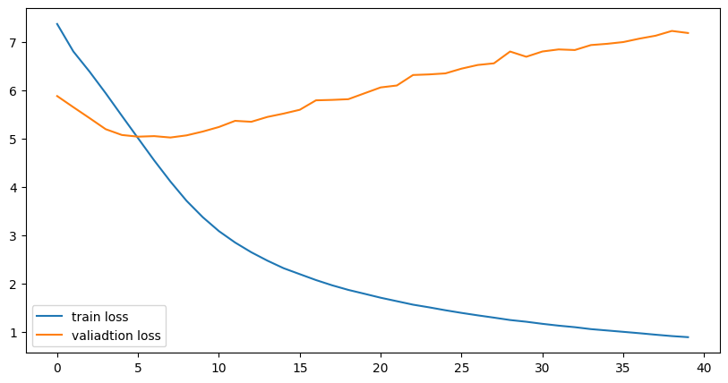
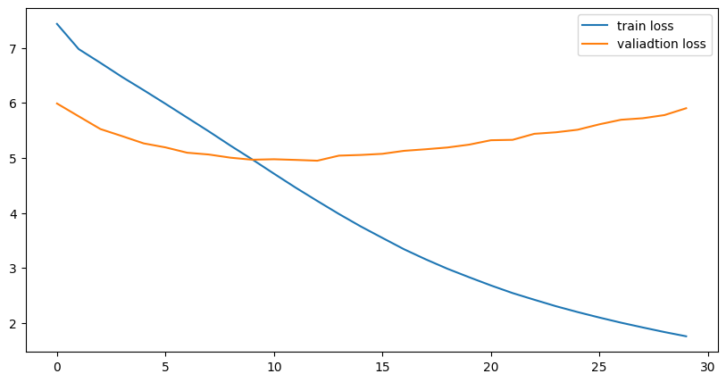

# Arabic2English - Arabic to English Translator

**This is a PyTorch implementation of an Arabic to English Neural Machine Translation built using Transformers architecture ([Attention Is All You Need](https://arxiv.org/pdf/1706.03762.pdf))**


# Setup and Requirements
**1. CUDA:**
<br/>
install [CUDA](https://developer.nvidia.com/cuda-downloads) before installing the required packages or check if it is already installed 
<br/>
<br/>
**2. Clone the Translate repo:**
```
$ git clone clone https://github.com/Strifee/arabic2english.git
```
**3. install requirements:**
```
pip install -r requirements.txt
```
`if you have problem with CUDA package try this:`
```
conda install -q pytorch torchvision cudatoolkit=11 -c pytorch-nightly
```

# Data

**Arabic to English Translation Sentences :**

[Arabic to English Translation Sentences](https://www.kaggle.com/samirmoustafa/arabic-to-english-translation-sentences) is a dataset for machine translation between English  and Arabic.

# Training

**1. Clone the Translate repo:**
```
$ git clone clone https://github.com/Strifee/arabic2english.git
```
**2. Training**
```
$ python translate.py
```
**2. Regularization**
### Hyperparameters :
```python
BATCH_SIZE = 16
learning_rate = 0.0001
num_epochs = 30

num_heads = 8
num_encoder_layers = 3
num_decoder_layers = 3

max_len= 230
dropout = 0.4
embedding_size= 256
```
### Before regularization :

<br/>

### After regularization :

<br/>

# Results
```
"I'm ready" -> 'أنا مستعد'
"i'm lucky"  -> 'انا محظوظ'
"I'm sad" -> 'أنا حزين'

```

